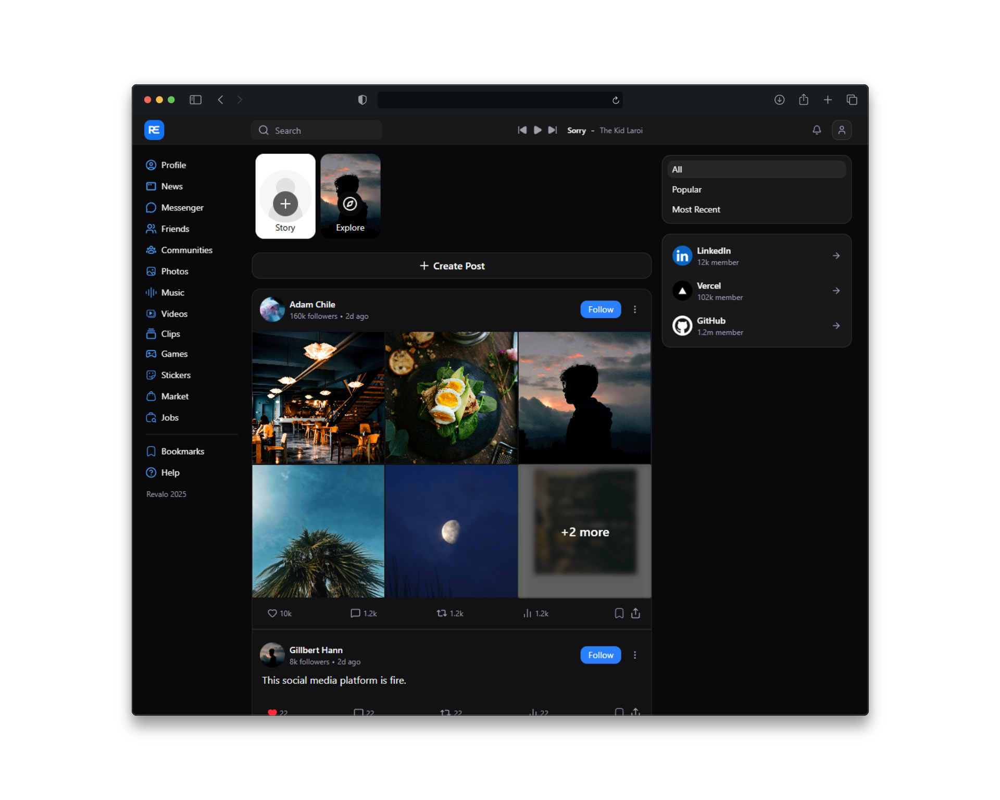

# Revalo - Social Super‑App MVP
Revalo is a social super‑app MVP combining feed, clips, real‑time chat, and profiles into a cohesive, community‑driven experience.

### Highlights
- Unified experience: feed, short clips, live chat, and profiles in one MVP.
- Built with a modern TypeScript‑first stack focused on performance and DX.
- Designed to expand into communities, notifications, and creator tools.

### Tech Stack
- Framework: React (TypeScript) with app‑directory routing.
- Styling: CSS modules/Tailwind (adjust to actual choice) with responsive layout.
- State/Data: React Query/TanStack Query or server components where suitable.
- Realtime: WebSocket/Socket.io or Next.js server actions for chat (TBD).
- Storage: Postgres/Prisma or Supabase/Firestore (TBD).

### Roadmap
- Core
  - Feed: posts, reactions, comments, pagination.
  - Clips: short‑form video with previews and scrubbing.
  - Chat: 1‑1 real‑time messaging, online presence.
  - Profiles: editable bio, links, activity.

- Platform
  - Auth: email/pass + OAuth providers.
  - Notifications: in‑app and push (TBD).
  - Media: uploads, thumbnails, CDN (TBD).

- Nice‑to‑have
  - Communities/spaces, moderation, analytics.
